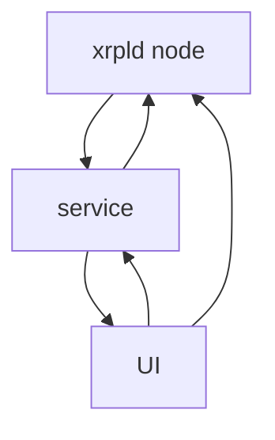

# XRP Ledger Node Manager

PoC. Work in progress...

User friendly tool to manage a XRPL Node.

There are two components: 

- `service`: a rust backend interacting with the XRPL Node. It connects via websockets to the node and also executes adhoc requests.
- `ui`: Frontend that connects to the `service` to provide functionality.

## Run locally

For now, you need to be running (or point to one with admin access) a `rippled` node. Configuration can be changed in the `service` (`config` folder)

### Service

`cd service && cargo run`

### UI

`cd ui && yarn dev`

## Demo

## TODO/Ideas

- Issue tokens (dev)
- AMM features
- Sidechains
- Wallet creation / Faucet (dev)
- Explorer
- ...
